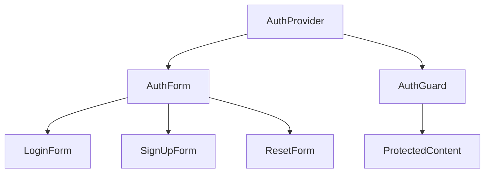

# Authentication Components

## Component Tree



## Individual Components

### AuthForm

Location: `/app/components/auth/auth-form.tsx`

Purpose:

- Main authentication UI component
- Handles user login, signup, and password reset
- Manages form state and validation

Props Interface:

```typescript
interface AuthFormProps {
  view?: "sign_in" | "sign_up" | "forgotten_password";
  redirectTo?: string;
  onSuccess?: () => void;
}
```

Usage Example:

```tsx
<AuthForm
  view="sign_in"
  redirectTo="/dashboard"
  onSuccess={() => console.log("Authenticated")}
/>
```

State Management:

- Uses local state for form data
- Integrates with Supabase Auth
- Handles loading and error states

### AuthProvider

Location: `/app/components/auth/auth-provider.tsx`

Purpose:

- Provides authentication context
- Manages session state
- Handles token refresh

Props Interface:

```typescript
interface AuthProviderProps {
  children: React.ReactNode;
  initialSession?: Session | null;
}
```

Usage Example:

```tsx
<AuthProvider initialSession={session}>
  <App />
</AuthProvider>
```

Context Interface:

```typescript
interface AuthContext {
  session: Session | null;
  user: User | null;
  signOut: () => Promise<void>;
  refreshSession: () => Promise<void>;
}
```

### AuthGuard

Location: `/app/components/auth/auth-guard.tsx`

Purpose:

- Protects routes from unauthorized access
- Handles redirect logic
- Shows loading states

Props Interface:

```typescript
interface AuthGuardProps {
  children: React.ReactNode;
  fallback?: React.ReactNode;
  requireAuth?: boolean;
}
```

Usage Example:

```tsx
<AuthGuard requireAuth>
  <DashboardContent />
</AuthGuard>
```

### AuthErrorBoundary

Location: `/app/components/auth/auth-error-boundary.tsx`

Purpose:

- Catches authentication errors
- Provides fallback UI
- Handles error reporting

Props Interface:

```typescript
interface AuthErrorBoundaryProps {
  children: React.ReactNode;
  fallback?: React.ReactNode;
  onError?: (error: Error) => void;
}
```

Usage Example:

```tsx
<AuthErrorBoundary fallback={<AuthErrorFallback />} onError={handleError}>
  <AuthForm />
</AuthErrorBoundary>
```

## State Management

### Authentication State

```typescript
interface AuthState {
  session: Session | null;
  user: User | null;
  loading: boolean;
  error: Error | null;
}
```

### Form State

```typescript
interface FormState {
  email: string;
  password: string;
  loading: boolean;
  error: string | null;
}
```

## Event Handlers

### Form Submission

```typescript
const handleSubmit = async (e: React.FormEvent) => {
  e.preventDefault();
  setLoading(true);
  try {
    await signIn(email, password);
    onSuccess?.();
  } catch (error) {
    setError(error.message);
  } finally {
    setLoading(false);
  }
};
```

### Session Management

```typescript
const refreshSession = async () => {
  try {
    const session = await supabase.auth.getSession();
    setSession(session);
  } catch (error) {
    logger.error("Session refresh failed", error);
  }
};
```

## Loading States

1. Initial Loading:

```tsx
{
  loading && <LoadingSpinner />;
}
```

2. Form Submission:

```tsx
<Button disabled={loading}>{loading ? "Signing in..." : "Sign in"}</Button>
```

## Error States

1. Form Errors:

```tsx
{
  error && (
    <Alert variant="destructive">
      <AlertTitle>Error</AlertTitle>
      <AlertDescription>{error}</AlertDescription>
    </Alert>
  );
}
```

2. Session Errors:

```tsx
<AuthErrorBoundary>
  <FallbackError error={error} reset={resetError} />
</AuthErrorBoundary>
```

## Styling

Using Tailwind CSS classes:

```tsx
<div className="flex flex-col space-y-4">
  <Input
    className="w-full px-4 py-2 border rounded-md"
    type="email"
    placeholder="Email"
  />
  <Button className="w-full bg-primary text-white" type="submit">
    Sign in
  </Button>
</div>
```

## Testing

See [testing.md](./testing.md) for component test cases and examples.
