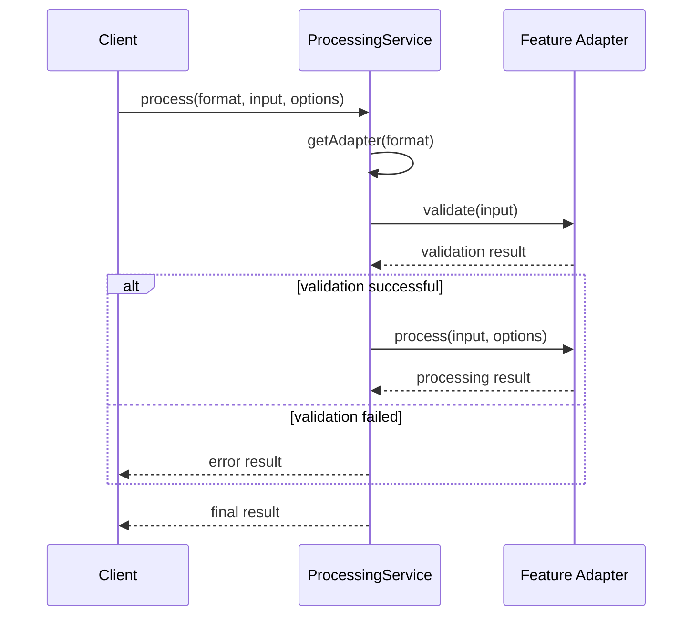
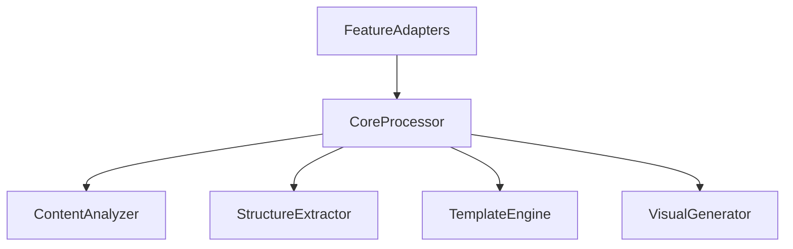

# Core Processing Components

## Component Overview

The core processing feature consists of the following main components:

1. **Processing Service**

   - Central orchestration
   - Adapter management
   - Processing coordination
   - Error handling

2. **Feature Adapters**
   - PodcastProcessingAdapter
   - PostProcessingAdapter
   - Common interface implementation
   - Feature-specific processing

## Component Details

### Processing Service

The processing service manages the overall processing flow and coordinates between different adapters:

```typescript
class ProcessingService {
  private adapters: Map<string, ProcessingAdapter>;

  constructor() {
    this.adapters = new Map();
  }

  registerAdapter(format: string, adapter: ProcessingAdapter): void {
    this.adapters.set(format, adapter);
  }

  async process(
    format: string,
    input: string,
    options: ProcessingOptions
  ): Promise<ProcessingResult> {
    // Implementation details...
  }
}
```

### PodcastProcessingAdapter

Handles podcast-specific content processing:

```typescript
class PodcastProcessingAdapter implements ProcessingAdapter {
  async validate(input: string | any): Promise<boolean> {
    // Input validation logic
  }

  async process(
    input: string,
    options: ProcessingOptions
  ): Promise<ProcessingResult> {
    // Podcast processing implementation
  }

  async getStatus(id: string): Promise<ProcessingResult> {
    // Status tracking implementation
  }
}
```

### PostProcessingAdapter

Handles post-specific content processing:

```typescript
class PostProcessingAdapter implements ProcessingAdapter {
  async validate(input: string | any): Promise<boolean> {
    // Input validation logic
  }

  async process(
    input: string,
    options: ProcessingOptions
  ): Promise<ProcessingResult> {
    // Post processing implementation
  }

  async getStatus(id: string): Promise<ProcessingResult> {
    // Status tracking implementation
  }
}
```

## Component Interactions



## Error Handling

Both adapters implement consistent error handling:

1. **Validation Errors**

   - Input format validation
   - Content requirements
   - Size limits

2. **Processing Errors**

   - Transformation failures
   - Analysis errors
   - Resource constraints

3. **Status Tracking**
   - Process monitoring
   - Error reporting
   - Result delivery

## Testing

Components are tested with:

- Unit tests (~94% coverage)
- Error handling tests
- Integration tests (pending)
- Performance tests (pending)

## Future Considerations

1. **New Adapters**

   - Additional content types
   - Platform-specific adapters
   - Custom processing needs

2. **Optimizations**

   - Performance improvements
   - Resource utilization
   - Caching strategies

3. **Extensions**
   - Additional analysis types
   - New processing features
   - Enhanced error handling



## Core Components

### CoreProcessor

```typescript
export class CoreProcessor implements ContentProcessor {
  constructor(
    private analyzer: ContentAnalyzer,
    private extractor: StructureExtractor,
    private templateEngine: TemplateEngine,
    private visualGenerator: VisualGenerator
  ) {}

  async process(input: ContentInput): Promise<ProcessedContent>;
  async analyze(content: RawContent): Promise<AnalyzedContent>;
  async extract(analyzed: AnalyzedContent): Promise<StructuredContent>;
  async transform(structured: StructuredContent): Promise<VisualContent>;
}
```

**Purpose**: Central orchestrator for the processing pipeline
**Location**: `/app/features/core-processing/CoreProcessor.ts`
**Usage**: Main entry point for content processing

### ContentAnalyzer

```typescript
export interface ContentAnalyzer {
  analyze(content: RawContent): Promise<AnalyzedContent>;
  detectStructure(content: RawContent): Promise<ContentStructure>;
  extractMetadata(content: RawContent): Promise<ContentMetadata>;
}
```

**Purpose**: Analyzes raw content to understand its structure and meaning
**Location**: `/app/features/core-processing/analyzers/`
**Usage**: Content understanding and classification

### StructureExtractor

```typescript
export interface StructureExtractor {
  extract(content: AnalyzedContent): Promise<StructuredContent>;
  identifySegments(content: AnalyzedContent): Promise<ContentSegment[]>;
  mapRelationships(segments: ContentSegment[]): Promise<SegmentRelationships>;
}
```

**Purpose**: Extracts structured information from analyzed content
**Location**: `/app/features/core-processing/extractors/`
**Usage**: Converting raw content into structured format

### TemplateEngine

```typescript
export interface TemplateEngine {
  applyTemplate(
    content: StructuredContent,
    templateId: string
  ): Promise<TemplatedContent>;
  getTemplate(templateId: string): Promise<Template>;
  validateContent(content: StructuredContent, template: Template): boolean;
}
```

**Purpose**: Applies templates to structured content
**Location**: `/app/features/core-processing/templates/`
**Usage**: Visual presentation and formatting

### VisualGenerator

```typescript
export interface VisualGenerator {
  generate(content: TemplatedContent): Promise<VisualContent>;
  optimizeMedia(content: TemplatedContent): Promise<OptimizedMedia>;
  validateOutput(content: VisualContent): Promise<ValidationResult>;
}
```

**Purpose**: Generates final visual output
**Location**: `/app/features/core-processing/generators/`
**Usage**: Final content generation and optimization

## Feature Adapters

### Base Adapter

```typescript
export abstract class BaseFeatureAdapter implements FeatureAdapter {
  abstract adapt(input: any): ContentInput;
  abstract transform(output: VisualContent): any;
  abstract getConfig(): ProcessingConfig;

  protected validateInput(input: any): boolean;
  protected sanitizeOutput(output: any): any;
}
```

### PodcastAdapter

```typescript
export class PodcastAdapter extends BaseFeatureAdapter {
  adapt(podcast: PodcastInput): ContentInput;
  transform(output: VisualContent): PodcastOutput;
  getConfig(): ProcessingConfig;
}
```

### PostAdapter

```typescript
export class PostAdapter extends BaseFeatureAdapter {
  adapt(post: PostInput): ContentInput;
  transform(output: VisualContent): PostOutput;
  getConfig(): ProcessingConfig;
}
```

## Utility Components

### ProcessingQueue

```typescript
export interface ProcessingQueue {
  add(task: ProcessingTask): Promise<string>;
  getStatus(taskId: string): Promise<TaskStatus>;
  cancel(taskId: string): Promise<void>;
}
```

### ProgressTracker

```typescript
export interface ProgressTracker {
  updateProgress(taskId: string, progress: number): void;
  getProgress(taskId: string): number;
  onProgress(taskId: string, callback: ProgressCallback): void;
}
```

## State Management

### ProcessingState

```typescript
interface ProcessingState {
  tasks: Map<string, TaskStatus>;
  progress: Map<string, number>;
  errors: Map<string, Error>;
}
```

### Configuration State

```typescript
interface ConfigurationState {
  defaultConfig: ProcessingConfig;
  featureConfigs: Map<string, ProcessingConfig>;
  templates: Map<string, Template>;
}
```

## Event Handling

### ProcessingEvents

```typescript
enum ProcessingEvent {
  TASK_STARTED = "task_started",
  TASK_PROGRESS = "task_progress",
  TASK_COMPLETED = "task_completed",
  TASK_FAILED = "task_failed",
}
```

### Event Handlers

```typescript
interface ProcessingEventHandlers {
  onTaskStarted(taskId: string): void;
  onTaskProgress(taskId: string, progress: number): void;
  onTaskCompleted(taskId: string, result: ProcessedContent): void;
  onTaskFailed(taskId: string, error: Error): void;
}
```
