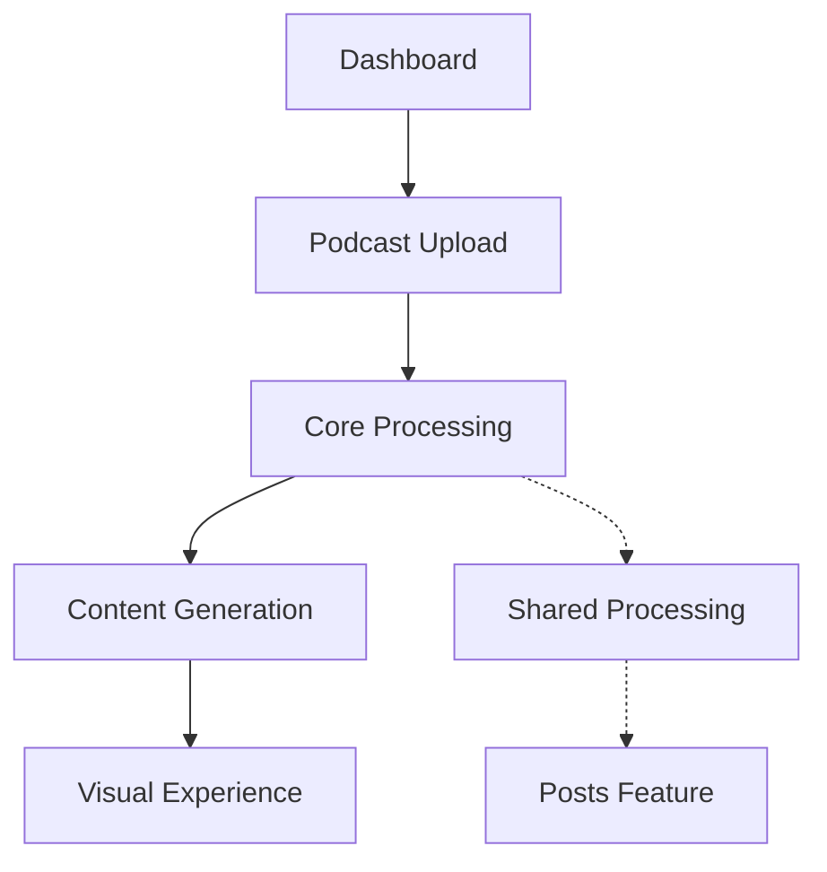

# Podcast Feature Architecture

## System Design

### High-Level Overview

The podcast feature is built on a modular architecture that separates concerns between:

Note: The existing processing logic in both podcast and posts features will be deprecated and removed once the core processing migration is complete. All processing will be handled by the shared core processing module.

- Upload and storage
- Processing and transformation (In Progress)
- Content presentation
- User interaction

### Component Relationships

Note: Core Processing implementation is currently in progress. The structure and interfaces are in place, but the actual processing logic is pending implementation.

## Technical Decisions

### Technology Choices

- **Next.js 14**: Server components for efficient rendering
- **Core Processing**: Shared module for content transformation (Structure implemented, processing logic pending)
- **TypeScript**: Type safety across the feature
- **Tailwind CSS**: Responsive design implementation

### Design Patterns

1. **Server Components First**

   - Default to server components
   - Client components only when necessary
   - Efficient data loading patterns

2. **Shared Processing Core**

   - Modular processing system with adapter pattern
   - Structure and interfaces implemented
   - Processing logic implementation pending
   - Will be reusable across features once complete

3. **Content Templates**
   - Standardized output formats
   - Customizable templates
   - Consistent visual presentation

## Dependencies

### External Services

- Audio processing services
- Content transformation APIs (To be implemented)
- Storage solutions

### Internal Dependencies

- Core processing module (Structure only, processing pending)
- Content templating system
- UI components library

### Configuration Requirements

- Audio processing settings (TBD)
- Transformation parameters (TBD)
- Template configurations

See [Core Processing Documentation](../core-processing/README.md) for current implementation status and plans.
