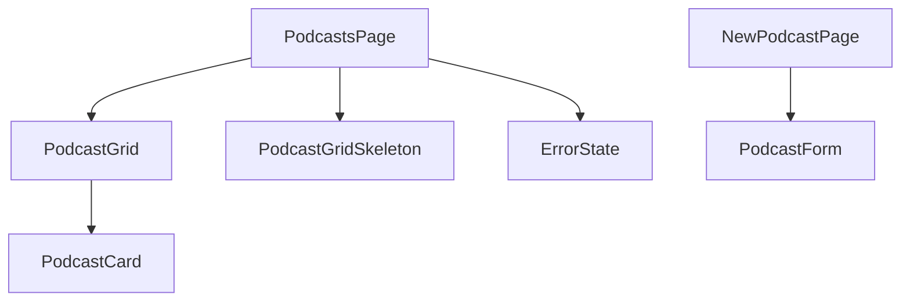

# Podcast Feature Components

## Component Tree



## Individual Components

### PodcastsPage

- **Purpose**: Main dashboard page for podcast management
- **Location**: `/app/dashboard/podcasts/page.tsx`
- **Type**: Client Component
- **Features**:
  - Displays podcast grid
  - Add new podcast button
  - Loading state handling
  - Error boundary implementation

### PodcastGrid

- **Purpose**: Grid display of podcast entries
- **Location**: `/app/components/dashboard/podcasts/PodcastGrid`
- **Type**: Client Component
- **Features**:
  - Responsive grid layout
  - Podcast card rendering
  - Empty state handling

### PodcastGridSkeleton

- **Purpose**: Loading state placeholder
- **Location**: `/app/dashboard/podcasts/page.tsx`
- **Type**: Client Component
- **Features**:
  - Animated loading cards
  - Responsive grid layout
  - Visual placeholder during data fetch

### ErrorState

- **Purpose**: Error handling display
- **Location**: `/app/dashboard/podcasts/page.tsx`
- **Type**: Client Component
- **Features**:
  - Error message display
  - User feedback
  - Recovery options

## State Management

### Podcast Data Flow

```typescript
interface PodcastData {
  id: string;
  title: string;
  description: string;
  audioUrl: string;
  status: "processing" | "completed" | "error";
  createdAt: string;
}
```

### Component Props

```typescript
interface PodcastGridProps {
  // Grid display configuration
}

interface PodcastCardProps {
  podcast: PodcastData;
  onStatusChange?: (id: string, status: string) => void;
}
```

## Shared UI Components

- Button (shadcn/ui)
- Card (shadcn/ui)
- Link (Next.js)
- Loading states
- Error boundaries

## Event Handlers

- Podcast upload
- Status updates
- Error handling
- Navigation events
