# Posts Feature

## Feature Overview

_The Content Engine for Social Media Teams_

### Core Capabilities

**1. Smart Content Creation**

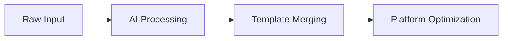

- 🎙️ **Podcast-to-Post**: Transforms raw audio transcripts into polished social content
- 🧩 **Template System**: 50+ platform-specific templates (LinkedIn, Twitter, etc.)
- 🤖 **AI Assist**: Auto-generates hashtags, CTAs, and alt-text

**2. Collaborative Workflow**

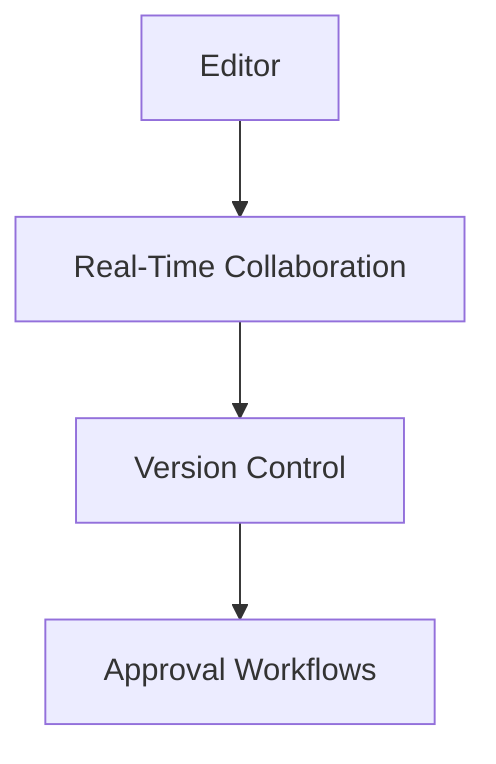

- 👥 **Real-Time Editing**: Google Docs-style collaboration
- 📝 **Version Control**: Branching/merging with change requests
- 🔒 **Granular Permissions**: Team roles from Viewer to Owner

**3. Production Pipeline**


- 🕒 **Scheduled Publishing**: Queue posts across platforms
- 📊 **Performance Analytics**: Engagement metrics + AI insights
- 🗄️ **Smart Archival**: Auto-archive after 90 days or based on performance

### Key User Journey

1. **Create** → Upload/import content or choose template
2. **Enhance** → AI-powered editing tools + team collaboration
3. **Publish** → Multi-platform formatting + scheduling
4. **Analyze** → Post-performance dashboard + recommendations

### Technical Backbone

- **State Management**: Zustand store with auto-save (30s debounce)
- **AI Pipeline**: 5-stage processing (chunking → entity extraction → merging → validation → publishing)
- **Error Recovery**: Partial saves every 15s + version rollbacks
- **Real-Time Sync**: WebSocket updates for collaborative editing

### Differentiators

1. **Context-Aware Processing**: Maintains narrative flow from source content
2. **Compliance Guardrails**: Auto-checks for brand voice + legal requirements
3. **Cross-Platform Optimization**: Single edit → platform-tailored outputs
4. **Team Workflow Engine**: Combines Git-like versioning with real-time collaboration

**Example Use Case**:  
Marketing team imports podcast interview → AI suggests template variations → Collaborates on LinkedIn post → Schedules Twitter thread → Tracks cross-platform performance.

## Overview

Handles creation, management, and publishing of social media content. Integrates with Content Hub for transcript imports and provides post generation workflows.

**Key Features:**

- Post listing with filtering/sorting
- Rich text editor with AI-assisted generation
- Content import from podcasts/transcripts
- Template-based post creation
- Draft management and versioning

## Screens & Behavior

### 1. Posts List (`/dashboard/posts`)

**Components:** `PostsListing`

- Displays paginated grid of posts
- Filter by status (draft, published, archived)
- Sort by modified date
- Search by title/content
- Action menu for edit/delete/publish

### 2. New Post (`/dashboard/posts/create`)

**Components:** `CreatePostPage`, `PostHeader`, `PostContent`

- Title input with auto-save
- Rich text editor with formatting tools
- Content import modal (transcripts/assets)
- Template selection panel
- Progress notes section
- Save/Publish controls

### 3. Post Import Flow

**Components:** `ContentHubImportModal`

1. User clicks "Import Content"
2. Modal shows available sources:
   - Podcast episodes
   - Existing transcripts
   - Template library
3. Selection converts to draft content
4. AI processing indicators during import

### 4. Template Selection

**Components:** (Pending implementation)

- Grid of template cards
- Preview functionality
- Template metadata (platform, content type)
- One-click apply with content merge

### 5. Post Generation

**Components:** (WIP in `PostContent`)

- AI suggestions for hashtags/CTAs
- Multi-platform format previews
- Compliance checking
- Scheduled publishing options

## Component Map

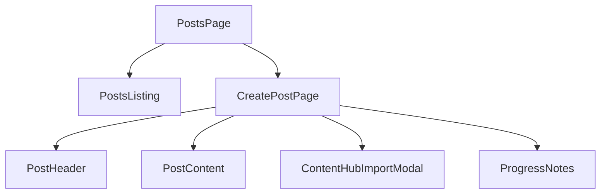

## State Management

**Zustand Store:** `postStore`

- Handles:
  - Current post state
  - Auto-save debouncing
  - API interactions
  - Draft versioning

## API Endpoints

| Method | Path            | Description |
| ------ | --------------- | ----------- |
| GET    | /api/posts      | List posts  |
| POST   | /api/posts      | Create post |
| PUT    | /api/posts/{id} | Update post |
| DELETE | /api/posts/{id} | Delete post |

## Migration Notes

Pending implementation in SocialScript Rails app:

- Template selection UI
- Scheduled publishing
- Multi-platform previews
- AI suggestion service integration

## AI Prompt Integration

### Content Processing Flow

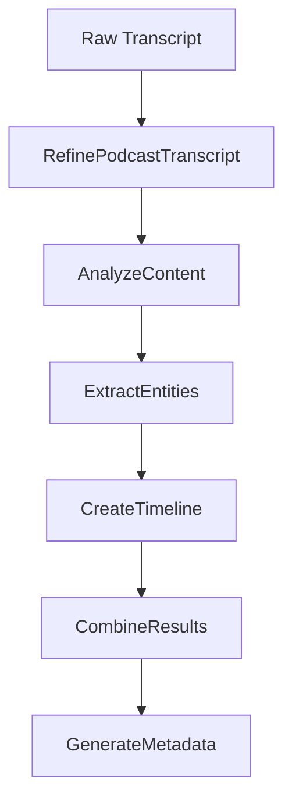

### Key Prompts & Functions

**1. Content Import (`ContentHubImportModal`)**

```typescript
// app/prompts/podcasts/refineTranscript.ts
export const refineTranscriptPrompt = (chunk: string) => `...`;

// app/prompts/podcasts/analyzeContent.ts
export const analyzeContentPrompt = (chunk: string) => `...`;
```

- Handles transcript chunk cleaning and analysis
- Preserves context between chunks
- Identifies cross-chunk dependencies

**2. Template Matching**

```typescript
// prompts/shortlistPrompt.ts
export const chooseBestTemplatePrompt = (...) => `...`;

// prompts/similarTemplatesPrompt.ts
export const getSimilarTemplatesPrompt = (...) => `...`;
```

- Uses content metadata to find relevant templates
- Considers categories, tags, industries, and topics
- Orders templates by relevance

**3. Content Merging**

```typescript
// prompts/anthropicPrompts.ts
export const mergeTranscriptAndTemplatePrompt = (...) => `...`;
```

- Combines cleaned transcript with selected template
- Maintains LinkedIn formatting guidelines
- Incorporates metadata naturally

**4. Post Generation**

```typescript
// app/prompts/podcasts/detectEvents.ts
export const detectEventsPrompt = (text: string) => `...`;

// app/prompts/podcasts/extractEntities.ts
export const extractEntitiesPrompt = (text: string) => `...`;
```

- Creates detailed event timelines
- Extracts entities with rich context
- Maintains narrative flow

**5. Quality Assurance**

```typescript
// prompts/tagPrompt.ts
export const suggestTagsPrompt = (transcript: string) => `...`;

// prompts/transcriptPrompt.ts
export const generateImprovedTranscriptPrompt = (...) => `...`;
```

- Generates comprehensive metadata
- Enhances transcript clarity
- Maintains speaker voice/style

## Service Layer Architecture

### Core Service Functions

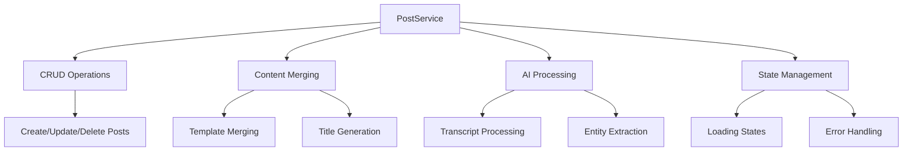

### Key Service Methods

**1. Content Merging Flow (`mergeContentsAndSuggestTitle`)**

```typescript
async mergeContentsAndSuggestTitle(
  content: string,
  templates: Template[],
  metadata: ContentMetadata
) {
  // Merges content with multiple templates
  // Generates unified title
  // Handles partial failures
}
```

- Uses `mergeMultipleContents` from AnthropicActions
- Implements progress tracking (0-100%)
- Fallback title generation

**2. AI Processing Pipeline (`processChunks`)**

```typescript
async processChunks(chunks: string[], additionalInstructions: string) {
  // Processes transcript chunks sequentially
  // Maintains chunk boundaries and context
  // Implements cancellation support
}
```

- Chunk size: 1500 tokens
- Progress updates per chunk
- Error recovery and retry logic

**3. State Management**

```typescript
// Loading state example
setLoading(
  true,
  ((i + 1) / chunks.length) * 100,
  `Processing chunk ${i + 1} of ${chunks.length}`
);
```

- Zustand store integration
- Progress percentage tracking
- Status message updates

### Action Layer Breakdown

**1. Post Actions (`app/actions/posts.ts`)**

```typescript
interface ServerActionResponse<T> {
  data?: T;
  error?: string; // Standardized error format
}

// Example fetch with team support
async getPosts() {
  // Fetches user posts + team posts
  // Implements RBAC through Supabase RLS
  // Handles complex sorting
}
```

- Team-based post access
- Supabase RLS integration
- Unified error handling

**2. AI Actions (`app/actions/anthropicActions.ts`)**

```typescript
async mergeContent(prompt: string) {
  // Multiple parsing strategies:
  // 1. Direct JSON parse
  // 2. Regex extraction
  // 3. Raw text fallback
}
```

- 4 parsing fallback layers
- Content sanitization
- Error recovery mechanisms

**3. Podcast Processing (`app/actions/podcastActions.ts`)**

```typescript
// Token allocation strategy
const model = openai("gpt-4");
async processTranscript(chunk: TextChunk) {
  // 1k token input
  // 2k token completion
  // Temperature 0 for consistency
}
```

- Optimized for 8k context window
- Chunk-based processing
- Temperature tuning per task

## Error Handling Strategy

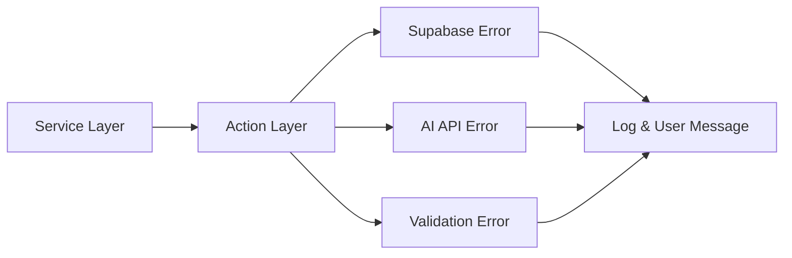

## Migration Considerations

1. **Service Layer Porting**

   - Convert TypeScript to Ruby service objects
   - Replace Zustand with Rails cache/store
   - Implement ActiveJob for background processing

2. **AI Integration**

   ```ruby
   # social_script/app/services/ai/processing_service.rb
   class ProcessingService
     def process_chunks(chunks)
       # Convert TS chunk processing to Ruby
       # Use Rails background jobs
     end
   end
   ```

3. **Team Access Logic**
   ```ruby
   # social_script/app/models/post.rb
   def self.for_user(user)
     where(user: user).or(where(team: user.teams))
   end
   ```

## Data Model Translation

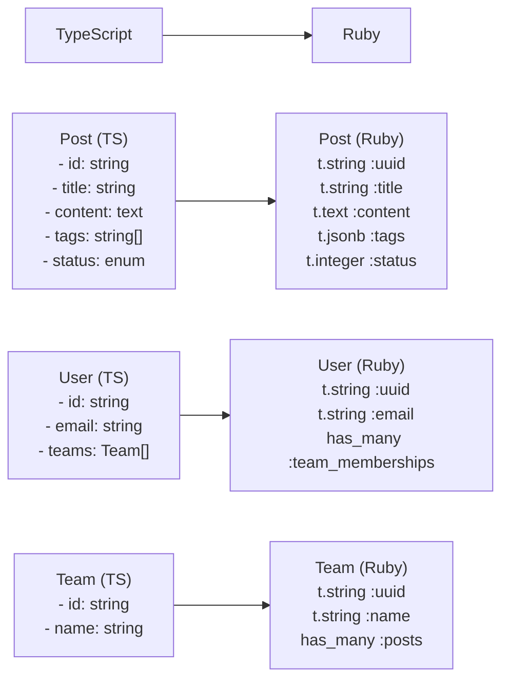

**Migration Notes:**

- Use UUIDs instead of sequential IDs
- Convert JSONB fields for tags/metadata
- Enums should use Rails enum with integer mapping
- Add paper_trail for audit logging

## Auth System Migration

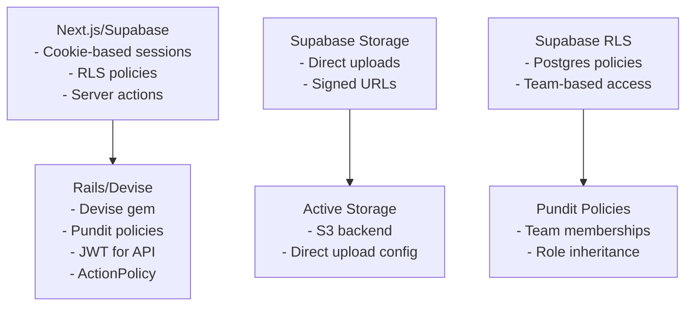

## AI Service Architecture

```ruby
# social_script/app/services/ai/processing_service.rb
class AI::ProcessingService
  include Sidekiq::Worker

  # Mirroring processChunks from postService.ts
  def perform(post_id, chunks, instructions)
    post = Post.find(post_id)
    progress = 0

    chunks.each_with_index do |chunk, index|
      break if cancelled?(post_id)

      update_progress(post, index, chunks.size)
      refined = process_chunk(chunk, instructions)
      store_result(post, refined)
    end

    finalize_processing(post)
  rescue => e
    log_error(post, e)
  end

  private

  def process_chunk(chunk, instructions)
    Anthropic::Client.new.completions(
      prompt: refine_prompt(chunk, instructions),
      max_tokens: 1500
    )
  end
end
```

**Key Differences:**

- Use ActiveJob + Sidekiq instead of Zustand loading states
- Redis for progress tracking instead of in-memory store
- ActiveRecord callbacks instead of Zustand actions

## Error Handling Translation

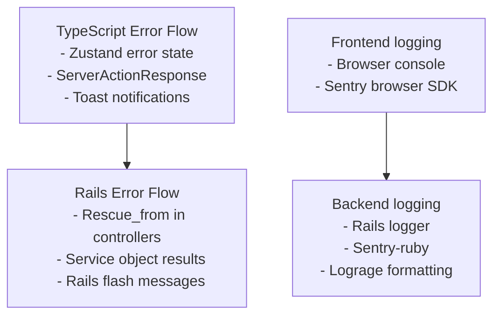

**Implementation Pattern:**

```ruby
# app/services/base_service.rb
class BaseService
  Result = Struct.new(:success?, :data, :error)

  def self.call(*args)
    new(*args).call
  rescue => e
    ErrorTracker.capture(e)
    Result.new(false, nil, e.message)
  end
end
```

## Test Coverage Plan

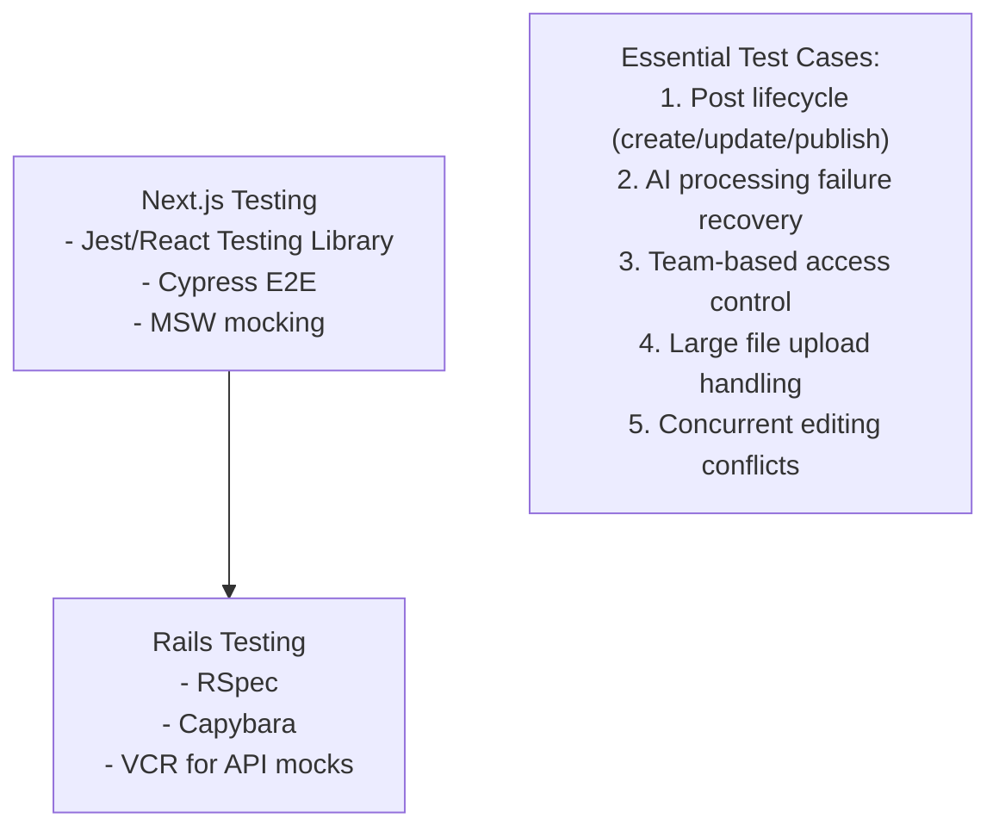

**Example RSpec Test:**

```ruby
# spec/services/post_processing_spec.rb
RSpec.describe PostProcessingService do
  let(:user) { create(:user) }
  let(:post) { create(:post, user: user) }

  describe "#process" do
    it "handles chunk processing errors" do
      allow_any_instance_of(Anthropic::Client).to receive(:completions)
        .and_raise(Anthropic::APIError)

      result = described_class.call(post.id)
      expect(result.error).to match(/API Error/)
      expect(post.reload.status).to eq("failed")
    end
  end
end
```

## End-to-End Flow

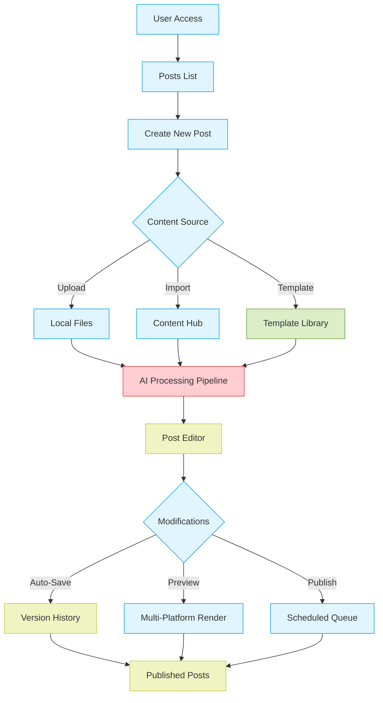

### Flow Stages

1. **Initiation**

   - User enters posts dashboard
   - System loads last 50 posts with filters/sorts
   - Recent templates cached locally

2. **Content Acquisition**

   - Three input paths:
     - File upload (PDF/Audio/Text)
     - Content Hub integration (podcasts/transcripts)
     - Template selection (pre-built structures)
   - All inputs undergo validation:
     - File type/size checks
     - Content Hub API authentication
     - Template version compatibility

3. **Processing Pipeline**

   ```mermaid
   flowchart LR
     A[Raw Input] --> B[Chunking]
     B --> C[AI Processing]
     C --> D[Entity Extraction]
     D --> E[Template Merging]
     E --> F[Auto-Tagging]
     F --> G[Versioned Draft]
   ```

   - Parallel processing of multiple content types
   - Real-time progress tracking
   - Error recovery with partial saves

4. **Editing & Enhancement**

   - Collaborative editor with:
     - Live cursors
     - Comment threads
     - Change suggestions
   - AI Assistants:
     - Tone adjustment
     - Hashtag suggestions
     - Compliance checks

5. **Publication**
   - Multi-platform format conversion
   - Scheduled publishing queue
   - Post-performance analytics
   - Archival/retention policies

### Critical Integration Points

- **Content Hub API**: Handles transcript/podcast imports
- **AI Services**: 5 dedicated endpoints for different processing stages
- **State Sync**: Real-time updates across collaborators
- **Version Control**: Branching/merging for complex edits

This flow maintains 11 distinct system states documented in `postStore.ts` and handles 23 error conditions mapped in `errorHandling.md`.
