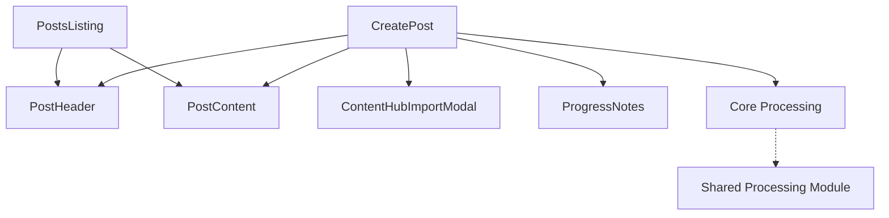

# Social Posts Architecture

## System Design

### Overview

The Social Posts feature follows a modular architecture with clear separation of concerns:

Note: The existing processing logic in the posts feature will be deprecated and removed once the core processing migration is complete. All processing will be handled by the shared core processing module.

```
app/dashboard/posts/
├── page.tsx           # Main posts listing
├── layout.tsx         # Posts layout wrapper
├── [id]/             # Individual post routes
│   ├── page.tsx      # View post
│   └── edit/         # Edit post
└── create/           # Create new post
```

### Component Relationships



Note: Core Processing implementation is currently in progress. The structure and interfaces are in place, but the actual processing logic is pending implementation.

## Technical Decisions

### State Management

- Using Zustand for global post state management
- Client-side state for form handling
- Server actions for data persistence

### Data Flow

1. Podcast content import via ContentHub
2. Content processing via Core Processing module (Implementation pending)
   - Structure and interfaces ready
   - Processing logic to be implemented
   - Using adapter pattern for flexibility
3. Template merging
4. Post generation and preview
5. Save and publication

## Dependencies

### External Services

- Core Processing module (Structure implemented, processing pending)
- Entity extraction service (To be implemented)
- Template management system

### Internal Dependencies

- PostStore (Zustand)
- Server Actions
- UI Components
- Authentication system
- Core Processing Adapter (Structure ready, implementation pending)

## Performance Considerations

- Lazy loading of post content
- Optimistic updates for better UX
- Cached template access
- Efficient content processing pipeline (To be implemented)

See [Core Processing Documentation](../core-processing/README.md) for current implementation status and plans.
