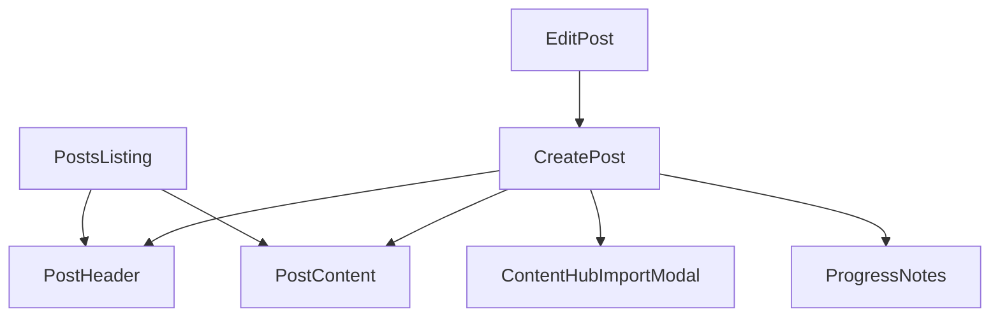

# Social Posts Components

## Component Tree



## Individual Components

### PostsListing

- **Purpose**: Main component for displaying all posts
- **Location**: `app/components/dashboard/posts/PostsListing.tsx`
- **Props**:
  ```typescript
  interface PostsListingProps {
    initialPosts: Post[];
  }
  ```
- **State Management**: Uses PostStore for global state
- **Key Features**:
  - Displays list of posts
  - Handles post filtering and sorting
  - Manages post selection

### PostHeader

- **Purpose**: Header component for post creation/editing
- **Location**: `app/components/dashboard/posts/PostHeader.tsx`
- **Props**:
  ```typescript
  interface PostHeaderProps {
    title: string;
    setTitle: (title: string) => void;
    onSave: () => void;
    onDelete?: () => void;
  }
  ```
- **Features**:
  - Title editing
  - Save functionality
  - Optional delete action

### PostContent

- **Purpose**: Main content editor for posts
- **Location**: `app/components/dashboard/posts/PostContent.tsx`
- **State**: Uses PostStore for content management
- **Features**:
  - Rich text editing
  - Content preview
  - Template integration

### ContentHubImportModal

- **Purpose**: Modal for importing podcast content
- **Location**: `app/components/dashboard/posts/ContentHubImportModal.tsx`
- **Props**:
  ```typescript
  interface ContentHubImportModalProps {
    isOpen: boolean;
    onClose: () => void;
    onImport: (transcript: string) => void;
  }
  ```
- **Features**:
  - Podcast content selection
  - Content preview
  - Import confirmation

### ProgressNotes

- **Purpose**: Display processing progress and notes
- **Location**: `app/components/dashboard/posts/ProgressNotes.tsx`
- **Props**:
  ```typescript
  interface ProgressNotesProps {
    progressNotes: string;
  }
  ```
- **Features**:
  - Progress tracking
  - Status updates
  - Error reporting
