# Type System Hierarchy

Last Updated: 2025-01-21 15:38

## Entity Type Relationships

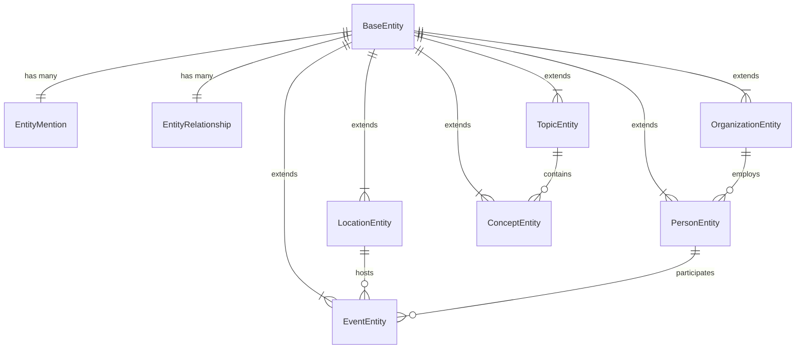

## Entity Type Details

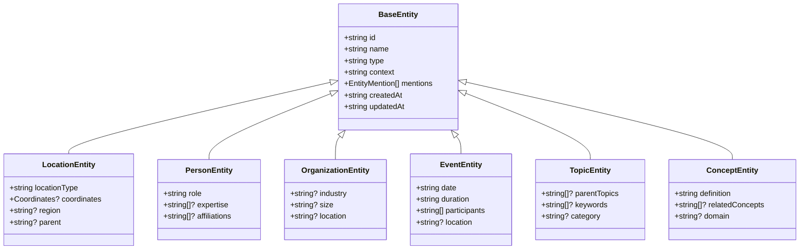

## Processing Type Relationships

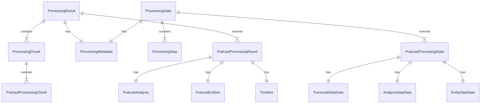

## Processing Type Details

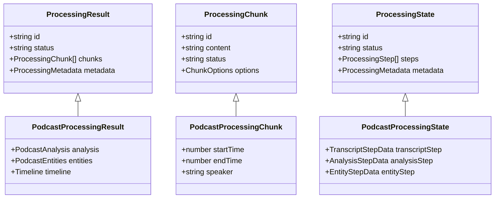

## UI Component Relationships

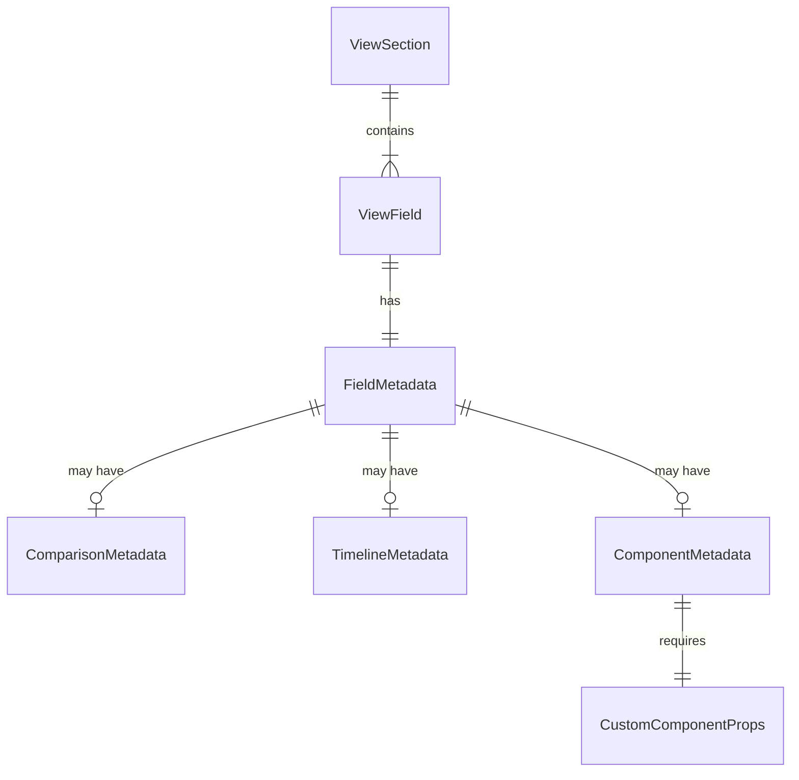

## UI Component Details

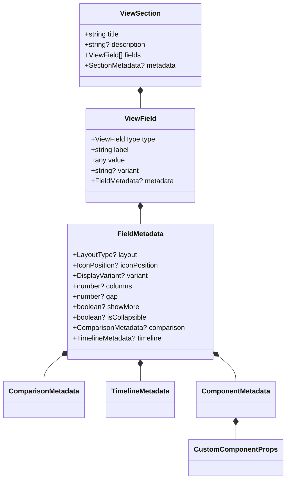

## Content Type Relationships

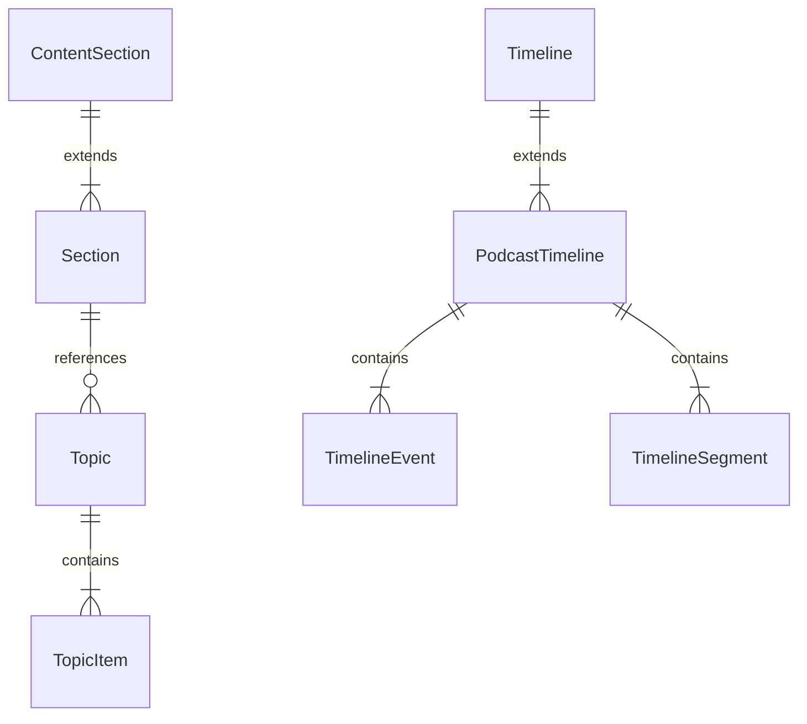

## Logging Type Relationships

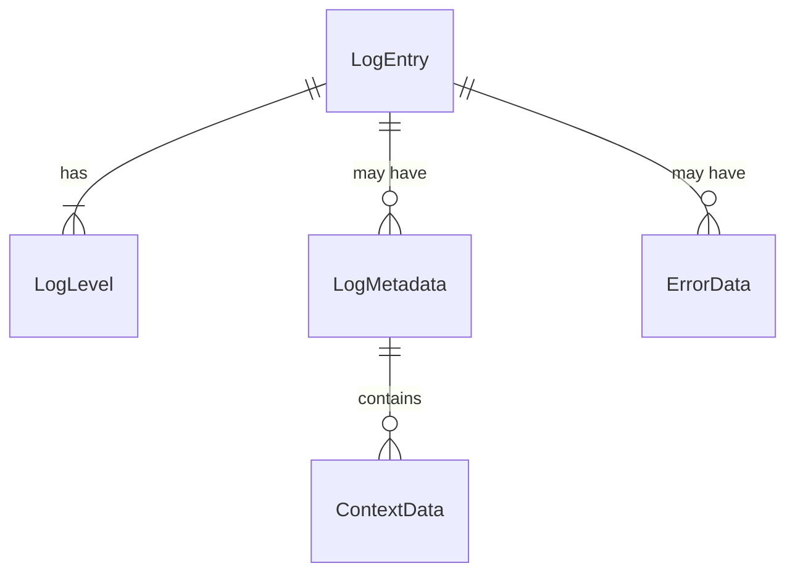

## Logging Type Details

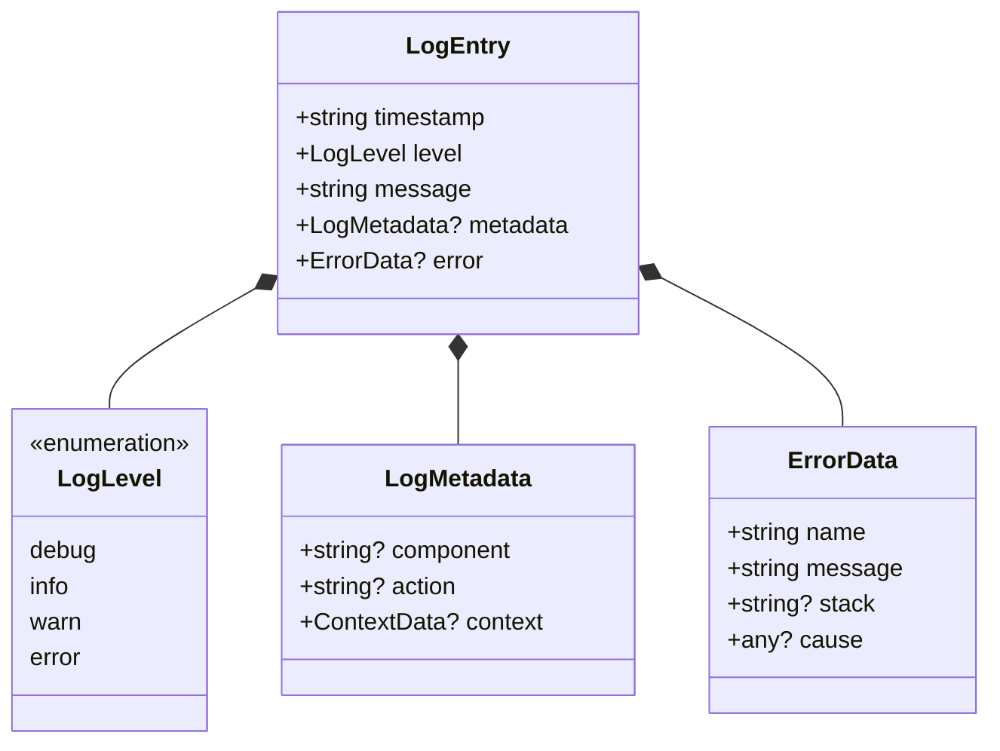

## UI Type Relationships

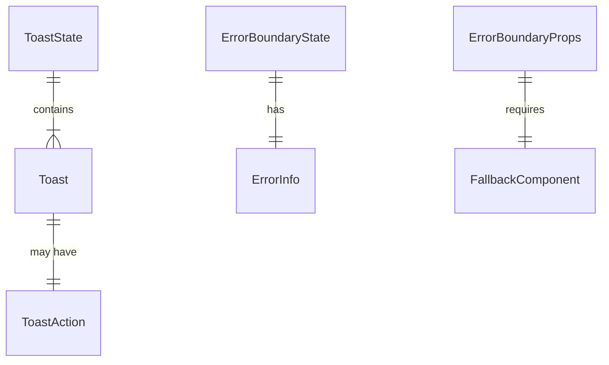

## UI Type Details

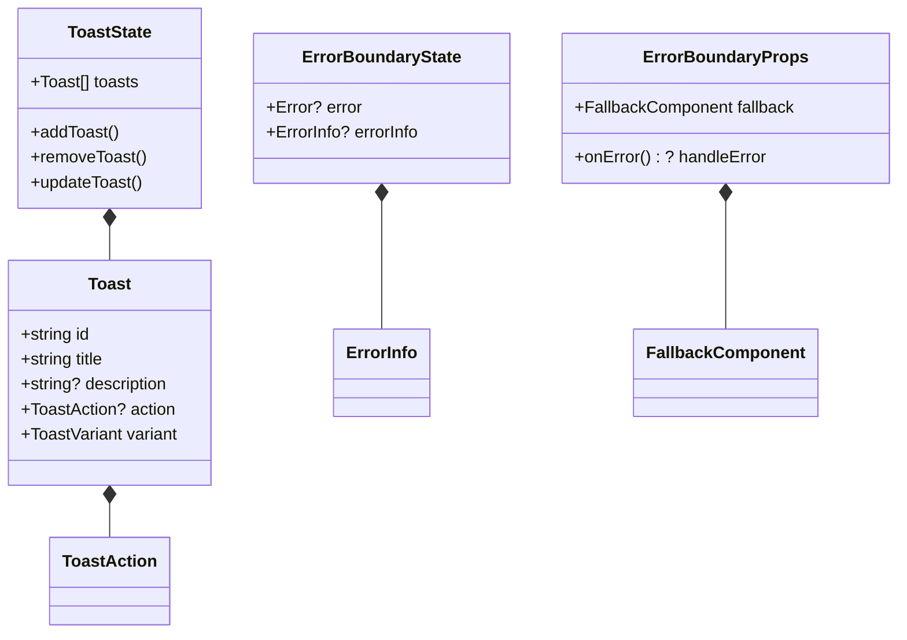

## Type Export Structure

```mermaid
flowchart TD
    A[/app/types/index.ts] --> B[entities/index.ts]
    A --> C[processing/index.ts]
    A --> D[shared/index.ts]
    A --> E[ui/index.ts]
    A --> F[logging/index.ts]

    B --> H[entities/base.ts]
    B --> I[entities/podcast.ts]
    B --> J[entities/validation.ts]

    C --> K[processing/base.ts]
    C --> L[processing/podcast.ts]

    D --> M[shared/content.ts]
    D --> N[shared/analysis.ts]
    D --> O[shared/timeline.ts]
    D --> P[shared/application.ts]

    E --> Q[ui/toast.ts]
    E --> R[ui/error-boundary.ts]
    E --> S[ui/processing.ts]
    E --> T[ui/badge.ts]

    F --> U[logging/index.ts]

    subgraph "Core Types"
    B
    C
    D
    end

    subgraph "Feature Types"
    H
    I
    J
    K
    L
    end

    subgraph "UI Types"
    E
    Q
    R
    S
    T
    end

    subgraph "Infrastructure Types"
    F
    U
    end
```

## Type Migration Status

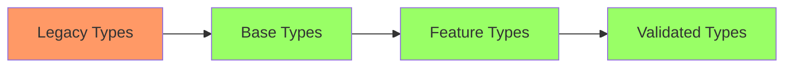

Legend:

- 🟥 Not Started
- 🟨 In Progress
- 🟩 Completed
